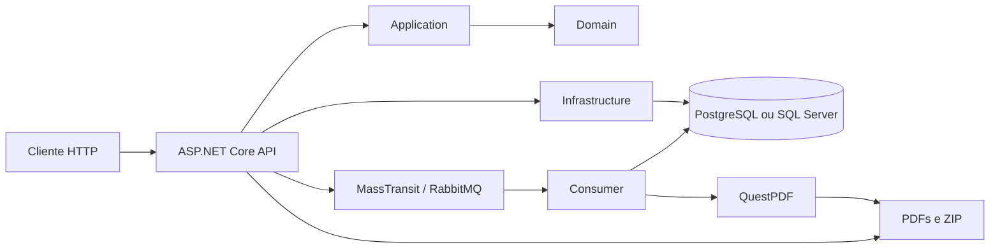
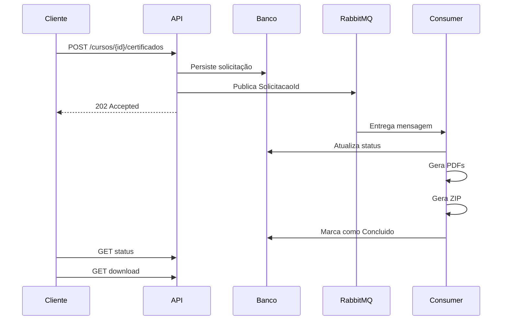
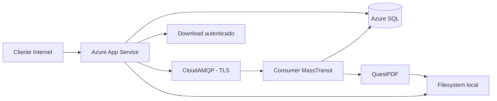

# 🎓 Gerador de Certificados

API REST desenvolvida em **ASP.NET Core / .NET 10** para gerenciamento de cursos e geração assíncrona de certificados em PDF.

O projeto permite cadastrar usuários, autenticar por JWT, cadastrar cursos, solicitar a geração de certificados para múltiplos alunos e acompanhar o processamento até a disponibilização de um arquivo ZIP para download.

A geração dos certificados é realizada de forma assíncrona utilizando **MassTransit + RabbitMQ**, com geração dos documentos através do **QuestPDF**.

A aplicação possui suporte a **PostgreSQL** e **SQL Server**, permitindo selecionar o provider de banco por configuração. Em produção, a solução utiliza **Azure App Service**, **Azure SQL** e **CloudAMQP**.

---

## 📋 Funcionalidades

Atualmente o sistema possui:

- Cadastro de usuários;
- Autenticação utilizando JWT;
- Armazenamento seguro de senhas por hash;
- Cadastro e consulta de cursos;
- Solicitação de geração de certificados para múltiplos alunos;
- Processamento assíncrono utilizando MassTransit e RabbitMQ;
- Geração de certificados em PDF com QuestPDF;
- Geração automática de arquivo ZIP contendo os certificados gerados;
- Consulta do status de processamento;
- Listagem dos certificados gerados;
- Download autenticado do ZIP;
- Suporte a PostgreSQL;
- Suporte a SQL Server / Azure SQL;
- Migrations separadas por provider;
- Tratamento global de exceções;
- Testes automatizados;
- Publicação automatizada no Azure através do GitHub Actions.

> **Frontend:** a interface gráfica não faz parte do escopo atual desta etapa do projeto. O frontend será abordado posteriormente conforme orientação das aulas.

---

## 🏗️ Arquitetura

O projeto utiliza uma organização baseada em separação de responsabilidades, dividindo domínio, casos de uso, infraestrutura e apresentação.



### Camadas

| Projeto | Responsabilidade |
|---|---|
| `GeradorCertificados.Api` | Controllers, contratos HTTP, autenticação, autorização e inicialização da aplicação |
| `GeradorCertificados.Application` | Casos de uso, services, commands, queries, handlers, contratos e abstrações |
| `GeradorCertificados.Domain` | Entidades, enums e regras de negócio |
| `GeradorCertificados.Infrastructure` | EF Core, repositories, PostgreSQL, SQL Server, MassTransit, RabbitMQ, QuestPDF e armazenamento de arquivos |
| `GeradorCertificados.Infrastructure.SqlServerMigrations` | Migrations e snapshot específicos do SQL Server |
| `GeradorCertificados.Application.Tests` | Testes automatizados com MSTest e Moq |

---

## 📁 Estrutura do projeto

```text
gerador-de-certificados/
│
├── .github/
│   └── workflows/
│
├── src/
│   ├── GeradorCertificados.Api/
│   │   ├── Controllers/
│   │   ├── Contracts/
│   │   ├── Program.cs
│   │   ├── appsettings.json
│   │   └── appsettings.Development.json
│   │
│   ├── GeradorCertificados.Application/
│   │   ├── Certificados/
│   │   ├── Cursos/
│   │   └── Usuarios/
│   │
│   ├── GeradorCertificados.Domain/
│   │   ├── Certificados/
│   │   ├── Cursos/
│   │   └── Usuarios/
│   │
│   ├── GeradorCertificados.Infrastructure/
│   │   ├── Certificados/
│   │   ├── Cursos/
│   │   ├── Persistencia/
│   │   │   └── Migrations/
│   │   ├── RabbitMq/
│   │   └── Usuarios/
│   │
│   └── GeradorCertificados.Infrastructure.SqlServerMigrations/
│       ├── Migrations/
│       └── SqlServerDbContextFactory.cs
│
├── tests/
│   └── GeradorCertificados.Application.Tests/
│       └── Modulos/
│
├── Directory.Build.props
├── GeradorCertificados.slnx
└── README.md
```

---

## 🛠️ Tecnologias utilizadas

### Backend

- .NET 10
- ASP.NET Core Web API
- Entity Framework Core 10
- MediatR
- JWT Bearer Authentication

### Banco de dados

- PostgreSQL
- Npgsql
- SQL Server
- Azure SQL

### Processamento assíncrono

- MassTransit
- RabbitMQ
- CloudAMQP

### Documentos

- QuestPDF
- Geração de arquivos ZIP

### Testes

- MSTest
- Moq
- Coverlet

### Cloud e CI/CD

- Microsoft Azure
- Azure App Service
- Azure SQL
- GitHub Actions
- CloudAMQP

---

# 🚀 Executando o projeto localmente

## 1. Pré-requisitos

Para executar a aplicação é necessário possuir:

- **.NET SDK compatível com .NET 10**;
- **PostgreSQL ou SQL Server**;
- **RabbitMQ** local ou outro broker RabbitMQ acessível;
- ferramenta `dotnet-ef` para gerenciamento manual das migrations.

A versão exata do SDK não está fixada através de `global.json`.

Para verificar o SDK instalado:

```powershell
dotnet --version
```

Caso ainda não possua o `dotnet-ef`:

```powershell
dotnet tool install --global dotnet-ef
```

Ou, caso já esteja instalado:

```powershell
dotnet tool update --global dotnet-ef
```

---

## 2. Clonar o repositório

```powershell
git clone <URL-DO-REPOSITORIO>
cd gerador-de-certificados
```

---

## 3. Restaurar as dependências

```powershell
dotnet restore
```

---

## 4. Configurar o banco de dados

A aplicação suporta dois providers:

```text
Postgres
SqlServer
```

A seleção é feita através de:

```text
Database:Provider
```

Se nenhum provider for informado, o padrão da aplicação é:

```text
Postgres
```

É necessário configurar apenas o provider que será utilizado.

---

# 🐘 PostgreSQL

Para utilizar PostgreSQL:

```powershell
$env:Database__Provider = "Postgres"
$env:ConnectionStrings__PostgresEF = "Host=localhost;Port=5432;Database=gerador_certificados;Username=postgres;Password=SUA_SENHA_LOCAL"
```

> A connection string acima é apenas um exemplo para ambiente local. Não versione senhas ou credenciais reais.

### Aplicar as migrations PostgreSQL

```powershell
dotnet ef database update `
  --project src/GeradorCertificados.Infrastructure/GeradorCertificados.Infrastructure.csproj `
  --startup-project src/GeradorCertificados.Api/GeradorCertificados.Api.csproj `
  --context GeradorCertificados.Infrastructure.Persistencia.AplicacaoDbContext
```

As migrations PostgreSQL ficam em:

```text
src/GeradorCertificados.Infrastructure/Persistencia/Migrations/
```

### Criar uma nova migration PostgreSQL

```powershell
dotnet ef migrations add NomeDaMigration `
  --project src/GeradorCertificados.Infrastructure/GeradorCertificados.Infrastructure.csproj `
  --startup-project src/GeradorCertificados.Api/GeradorCertificados.Api.csproj `
  --context GeradorCertificados.Infrastructure.Persistencia.AplicacaoDbContext `
  --output-dir Persistencia/Migrations
```

---

# 🗄️ SQL Server

Para utilizar SQL Server:

```powershell
$env:Database__Provider = "SqlServer"
$env:ConnectionStrings__SqlServerEF = "Server=localhost;Database=GeradorCertificados;Trusted_Connection=True;TrustServerCertificate=True"
```

Caso utilize outra instalação, LocalDB ou autenticação SQL Server, adapte a connection string para o ambiente local.

> Não utilize credenciais de produção em arquivos versionados.

### Aplicar as migrations SQL Server

```powershell
dotnet ef database update `
  --project src/GeradorCertificados.Infrastructure.SqlServerMigrations/GeradorCertificados.Infrastructure.SqlServerMigrations.csproj `
  --startup-project src/GeradorCertificados.Infrastructure.SqlServerMigrations/GeradorCertificados.Infrastructure.SqlServerMigrations.csproj `
  --context GeradorCertificados.Infrastructure.Persistencia.AplicacaoDbContext
```

As migrations SQL Server ficam em:

```text
src/GeradorCertificados.Infrastructure.SqlServerMigrations/Migrations/
```

### Criar uma nova migration SQL Server

```powershell
dotnet ef migrations add NomeDaMigration `
  --project src/GeradorCertificados.Infrastructure.SqlServerMigrations/GeradorCertificados.Infrastructure.SqlServerMigrations.csproj `
  --startup-project src/GeradorCertificados.Infrastructure.SqlServerMigrations/GeradorCertificados.Infrastructure.SqlServerMigrations.csproj `
  --context GeradorCertificados.Infrastructure.Persistencia.AplicacaoDbContext `
  --output-dir Migrations
```

> As migrations de PostgreSQL e SQL Server são independentes. Não execute migrations de um provider utilizando o projeto do outro provider.

### Migrations em produção

Durante o ambiente `Development`, a aplicação possui suporte à execução de:

```csharp
Database.Migrate()
```

Em `Production`, as migrations não são aplicadas automaticamente durante a inicialização da API.

Isso permite que alterações de schema em produção sejam realizadas de maneira controlada.

---

# 🐇 RabbitMQ

O processamento dos certificados depende de RabbitMQ.

A configuração local padrão utiliza:

```text
Host: localhost
Username: guest
Password: guest
VirtualHost: /
Port: 5672
UseSsl: false
```

A fila utilizada para processamento é:

```text
processar-solicitacao-certificados
```

O consumer responsável é:

```text
ProcessarSolicitacaoCertificadosConsumer
```

A política de retry configurada realiza:

```text
3 tentativas
intervalo de 2 segundos
```

## Executando RabbitMQ com Docker

O repositório não possui `docker-compose.yml`.

Caso Docker esteja instalado, uma opção para desenvolvimento local é:

```powershell
docker run -d `
  --name rabbitmq `
  -p 5672:5672 `
  -p 15672:15672 `
  -e RABBITMQ_DEFAULT_USER=guest `
  -e RABBITMQ_DEFAULT_PASS=guest `
  rabbitmq:3-management
```

Nesse caso:

```text
AMQP: http://localhost:5672
Management UI: http://localhost:15672
```

> `guest/guest` deve ser utilizado somente em desenvolvimento local.

---

# 🔐 Configuração JWT

A autenticação utiliza JWT Bearer.

As configurações necessárias são:

```text
Jwt:Issuer
Jwt:Audience
Jwt:SigningKey
```

Para desenvolvimento, valores sensíveis podem ser configurados através de **User Secrets**:

```powershell
dotnet user-secrets init --project src/GeradorCertificados.Api/GeradorCertificados.Api.csproj
```

Exemplo:

```powershell
dotnet user-secrets set "Jwt:Issuer" "GeradorCertificados.Local" `
  --project src/GeradorCertificados.Api/GeradorCertificados.Api.csproj

dotnet user-secrets set "Jwt:Audience" "GeradorCertificados.Local" `
  --project src/GeradorCertificados.Api/GeradorCertificados.Api.csproj

dotnet user-secrets set "Jwt:SigningKey" "CHAVE_LOCAL_FORTE_E_NAO_VERSIONADA" `
  --project src/GeradorCertificados.Api/GeradorCertificados.Api.csproj
```

Nunca versione a chave real utilizada em produção.

---

# ⚙️ Configurações disponíveis

| Configuração | Finalidade | Sensível |
|---|---|---:|
| `Database:Provider` | Seleciona PostgreSQL ou SQL Server | Não |
| `ConnectionStrings:PostgresEF` | Connection string PostgreSQL | Sim |
| `ConnectionStrings:SqlServerEF` | Connection string SQL Server | Sim |
| `Jwt:Issuer` | Emissor do JWT | Não |
| `Jwt:Audience` | Audience do JWT | Não |
| `Jwt:SigningKey` | Chave de assinatura JWT | Sim |
| `RabbitMq:Host` | Host do RabbitMQ | Não |
| `RabbitMq:Username` | Usuário RabbitMQ | Sim |
| `RabbitMq:Password` | Senha RabbitMQ | Sim |
| `RabbitMq:VirtualHost` | Virtual host | Não |
| `RabbitMq:Port` | Porta AMQP/AMQPS | Não |
| `RabbitMq:UseSsl` | Habilita TLS | Não |
| `Certificados:DiretorioBase` | Diretório utilizado para PDFs e ZIPs | Não |

Em variáveis de ambiente, `:` é representado por `__`.

Exemplo:

```text
Database__Provider
RabbitMq__Host
Jwt__SigningKey
```

---

# ▶️ Executando a API

Após configurar banco, JWT e RabbitMQ:

```powershell
dotnet run --project src/GeradorCertificados.Api/GeradorCertificados.Api.csproj
```

As portas definidas em `launchSettings.json` são:

```text
HTTP  → http://localhost:5154
HTTPS → https://localhost:7225
```

A URL efetivamente utilizada deve ser confirmada pelo log exibido no startup.

### Verificar disponibilidade

```text
GET /
```

Resposta esperada:

```json
{
  "status": "online",
  "aplicacao": "Gerador de Certificados API"
}
```

### Health check

```text
GET /health
```

Resposta:

```json
{
  "status": "ok"
}
```

---

# 🔑 Autenticação

Os endpoints de autenticação são públicos.

Após o login, os demais endpoints de negócio exigem:

```http
Authorization: Bearer <token>
```

A aplicação utiliza uma fallback authorization policy, exigindo usuário autenticado por padrão.

## Regras de senha

A senha deve:

- possuir no mínimo 8 caracteres;
- conter pelo menos um número;
- conter pelo menos um caractere não alfanumérico.

## Email

O email é:

- validado;
- normalizado com `Trim`;
- convertido para lowercase;
- armazenado com restrição de unicidade.

---

# 🌐 Endpoints

## Disponibilidade

| Método | Endpoint | Autenticação | Descrição |
|---|---|---|---|
| `GET` | `/` | Não | Verifica se a API está online |
| `GET` | `/health` | Não | Health check básico |

---

## Autenticação

| Método | Endpoint | Autenticação | Descrição |
|---|---|---|---|
| `POST` | `/auth/cadastro` | Não | Cadastra um usuário |
| `POST` | `/auth/login` | Não | Autentica e retorna JWT |

### Cadastro

```json
{
  "email": "usuario@example.test",
  "senha": "SenhaSegura!2026"
}
```

### Login

Utiliza as credenciais cadastradas para obtenção do JWT.

---

## Cursos

| Método | Endpoint | Autenticação | Descrição |
|---|---|---|---|
| `POST` | `/cursos` | JWT | Cadastra um curso |
| `GET` | `/cursos/{cursoId}` | JWT | Consulta um curso |

### Criar curso

```json
{
  "nome": "Curso de C#",
  "descricao": "Curso de desenvolvimento",
  "cargaHoraria": 40,
  "dataConclusao": "2026-09-22"
}
```

---

## Certificados

| Método | Endpoint | Autenticação | Descrição |
|---|---|---|---|
| `POST` | `/cursos/{cursoId}/certificados` | JWT | Solicita geração de certificados |
| `GET` | `/cursos/{cursoId}/status` | JWT | Consulta status da solicitação |
| `GET` | `/cursos/{cursoId}/certificados` | JWT | Lista certificados |
| `GET` | `/cursos/{cursoId}/certificados/download` | JWT | Baixa o ZIP dos certificados |

### Solicitar certificados

```json
{
  "alunos": [
    "Aluno A",
    "Aluno B"
  ]
}
```

Quando a solicitação é aceita, a API retorna:

```text
HTTP 202 Accepted
```

A geração dos PDFs ocorre posteriormente pelo processamento assíncrono.

---

# 🔄 Fluxo funcional

O fluxo principal da aplicação é:

```text
Cadastro
   ↓
Login
   ↓
JWT
   ↓
Criação do curso
   ↓
Solicitação dos certificados
   ↓
HTTP 202 Accepted
   ↓
Persistência da solicitação
   ↓
MassTransit
   ↓
RabbitMQ
   ↓
Consumer
   ↓
QuestPDF
   ↓
PDFs
   ↓
ZIP
   ↓
Status Concluido
   ↓
Download
```

---

# 📨 Processamento assíncrono

A solicitação de certificados não gera os documentos diretamente durante a requisição HTTP.

A API persiste a solicitação e publica uma mensagem:

```text
ProcessarSolicitacaoCertificados(SolicitacaoId)
```

O fluxo é:



## Status da solicitação

Uma solicitação pode possuir os estados:

```text
Pendente
GerandoCertificados
GerandoZip
Concluido
Falha
```

## Status de cada certificado

```text
Pendente
Gerado
Falha
```

Uma falha individual não impede necessariamente o processamento dos demais certificados do lote.

Somente certificados com status `Gerado` são incluídos no ZIP.

A aplicação também impede múltiplas solicitações ativas para o mesmo curso através de regra de negócio e restrição de unicidade no banco para os estados ativos.

---

# 📄 PDFs e ZIP

Os certificados são gerados utilizando **QuestPDF**.

Por padrão, os arquivos ficam em:

```text
AppContext.BaseDirectory/certificados
```

Estrutura:

```text
certificados/
└── {SolicitacaoId}/
    ├── {CertificadoId}.pdf
    ├── {CertificadoId}.pdf
    └── certificados.zip
```

Os caminhos físicos dos arquivos não são expostos pela listagem pública da API.

O download do ZIP é realizado através de endpoint autenticado.

---

# 🧪 Testes automatizados

O projeto utiliza:

- MSTest;
- Moq;
- Coverlet.

Os testes são configurados para paralelização em nível de método:

```csharp
[assembly: Parallelize(Scope = ExecutionScope.MethodLevel)]
```

Para executar:

```powershell
dotnet test GeradorCertificados.slnx
```

Baseline validado durante a conclusão do projeto:

```text
Total:     105
Aprovados: 105
Falhos:    0
Ignorados: 0
```

A suíte cobre, entre outros:

- regras de domínio;
- serviços da Application;
- handlers;
- autenticação;
- cursos;
- certificados;
- consumer;
- publicação MassTransit;
- geração de PDF;
- geração de ZIP;
- download;
- configuração multi-provider;
- tratamento global de exceções.

---

# 🔨 Build

Para validar a solução:

```powershell
dotnet restore
dotnet build GeradorCertificados.slnx
dotnet test GeradorCertificados.slnx
```

O projeto utiliza:

```text
TreatWarningsAsErrors=true
```

além de nullable reference types e implicit usings habilitados.

---

# ☁️ Ambiente de produção

A solução foi preparada e validada utilizando:

```text
Cliente
   ↓
Azure App Service
   ├──────────────→ Azure SQL
   │
   └──────────────→ CloudAMQP
                         ↓
                     Consumer
                         ↓
                     QuestPDF
                         ↓
                     PDFs / ZIP
```



## Azure App Service

A API é publicada como uma aplicação ASP.NET Core no Azure App Service.

O endpoint raiz público permite verificar rapidamente se a aplicação está disponível:

```text
GET /
```

## Azure SQL

O ambiente de produção utiliza:

```text
Database:Provider=SqlServer
```

com a connection string fornecida externamente pela configuração do Azure.

## CloudAMQP

O RabbitMQ de produção utiliza CloudAMQP com suporte a:

- host configurável;
- usuário;
- senha;
- virtual host;
- porta configurável;
- TLS.

Para CloudAMQP, a aplicação suporta conexão segura utilizando TLS 1.2.

Nenhuma credencial do ambiente de produção é armazenada no código-fonte.

---

# 🔧 Configurações de produção

As configurações esperadas no ambiente de produção incluem:

```text
ASPNETCORE_ENVIRONMENT

Database__Provider

Jwt__Issuer
Jwt__Audience
Jwt__SigningKey

RabbitMq__Host
RabbitMq__Username
RabbitMq__Password
RabbitMq__VirtualHost
RabbitMq__Port
RabbitMq__UseSsl
```

A connection string utilizada em produção é:

```text
SqlServerEF
```

Os **valores reais não devem ser versionados no repositório**.

---

# 🔁 CI/CD

O deploy da API é automatizado através de GitHub Actions.

Workflow:

```text
.github/workflows/main_gerador-de-certificados-api.yml
```

O pipeline é executado em:

```text
push → main
```

e também permite execução manual através de:

```text
workflow_dispatch
```

Fluxo:

```text
Push na main
    ↓
GitHub Actions
    ↓
Setup .NET 10
    ↓
Build Release
    ↓
Publish Release
    ↓
Artifact
    ↓
Autenticação no Azure
    ↓
Azure App Service
    ↓
Production
```

O workflow utiliza:

- `windows-latest`;
- .NET SDK `10.x`;
- `dotnet build --configuration Release`;
- `dotnet publish -c Release`;
- artifact de publicação;
- autenticação Azure através de GitHub Secrets;
- `azure/webapps-deploy@v3`;
- slot `Production`.

As credenciais utilizadas pelo pipeline ficam armazenadas em **GitHub Secrets** e não no código-fonte.

---

# 🔒 Segurança

O projeto adota algumas medidas para evitar exposição de informações sensíveis.

## Senhas

As senhas dos usuários não são armazenadas em texto puro.

A autenticação utiliza hashing antes da persistência.

## JWT

Os endpoints de negócio são protegidos por JWT Bearer.

As chaves utilizadas para assinatura não devem ser versionadas.

## Secrets

Credenciais de produção devem ser armazenadas através de mecanismos externos, como:

- Azure App Settings;
- Azure Connection Strings;
- GitHub Secrets;
- .NET User Secrets para desenvolvimento.

## Tratamento global de exceções

A API possui um `GlobalExceptionHandler` responsável por registrar exceções inesperadas internamente.

Em caso de erro interno, o cliente recebe um `ProblemDetails` genérico.

Informações como:

- stack trace;
- mensagens internas de SQL;
- connection strings;
- JWT;
- secrets;

não são deliberadamente retornadas na resposta HTTP.

Isso permite manter informações úteis nos logs sem expor detalhes internos da aplicação ao cliente.

---

# 📊 Project Board

O desenvolvimento é organizado através de GitHub Issues e GitHub Projects.

O fluxo definido para o quadro é:

```text
Backlog
   ↓
To Do
   ↓
In Progress
   ↓
Done
```

As Issues representam os módulos e etapas do desenvolvimento e são atualizadas conforme o progresso da implementação.

O histórico Git também mantém o desenvolvimento dividido em commits incrementais e descritivos, permitindo acompanhar a evolução das funcionalidades.

---

# 📝 Histórico de desenvolvimento

O projeto foi desenvolvido incrementalmente, com commits separados para funcionalidades e etapas importantes, incluindo:

- usuários e autenticação;
- cursos e migrations;
- domínio e persistência dos certificados;
- MediatR e API;
- MassTransit e RabbitMQ;
- consumer assíncrono;
- QuestPDF;
- geração de ZIP;
- testes;
- suporte a SQL Server;
- preparação para Azure;
- CI/CD;
- logging global de exceções;
- endpoints públicos de disponibilidade.

Essa estratégia permite acompanhar a evolução do projeto e relacionar alterações às respectivas funcionalidades.

---

# ⚠️ Limitações conhecidas

## Armazenamento local

Atualmente PDFs e ZIPs são armazenados no filesystem da aplicação.

Essa estratégia atende ao escopo atual, porém não é ideal para ambientes com:

- múltiplas instâncias;
- scale-out;
- necessidade de armazenamento durável;
- redeploys;
- reinicializações da aplicação.

Uma evolução futura é utilizar **Azure Blob Storage**.

## Health check

O endpoint:

```text
GET /health
```

é um health check básico da aplicação.

Ele não realiza atualmente uma verificação profunda de dependências como banco de dados e RabbitMQ.

## Frontend

O frontend não faz parte do escopo atual desta etapa.

A interface gráfica será desenvolvida posteriormente conforme a evolução das aulas e requisitos do projeto.

---

# 🔮 Possíveis evoluções

Algumas melhorias que podem ser incorporadas futuramente:

- frontend para utilização da API;
- Azure Blob Storage para PDFs e ZIPs;
- readiness checks para banco e RabbitMQ;
- observabilidade e métricas;
- infraestrutura como código;
- ampliação do pipeline de CI/CD;
- novos formatos e layouts de certificados.

---

# ✅ Executando do zero — resumo rápido

Para uma nova instalação local:

### 1. Clone

```powershell
git clone <URL-DO-REPOSITORIO>
cd gerador-de-certificados
```

### 2. Restore

```powershell
dotnet restore
```

### 3. Escolha o banco

PostgreSQL:

```powershell
$env:Database__Provider = "Postgres"
$env:ConnectionStrings__PostgresEF = "<SUA_CONNECTION_STRING_LOCAL>"
```

ou SQL Server:

```powershell
$env:Database__Provider = "SqlServer"
$env:ConnectionStrings__SqlServerEF = "<SUA_CONNECTION_STRING_LOCAL>"
```

### 4. Configure JWT

Utilize User Secrets ou variáveis de ambiente para:

```text
Jwt__Issuer
Jwt__Audience
Jwt__SigningKey
```

### 5. Inicie RabbitMQ

Utilize RabbitMQ local em:

```text
localhost:5672
```

ou configure outro broker através das opções `RabbitMq`.

### 6. Aplique as migrations

Utilize o comando correspondente ao provider escolhido, conforme a seção **Banco de dados** deste README.

### 7. Execute os testes

```powershell
dotnet test GeradorCertificados.slnx
```

### 8. Execute a API

```powershell
dotnet run --project src/GeradorCertificados.Api/GeradorCertificados.Api.csproj
```

### 9. Verifique

Acesse:

```text
http://localhost:5154/
```

ou:

```text
http://localhost:5154/health
```

Com isso, a aplicação está pronta para cadastro, autenticação, criação de cursos e processamento de certificados.

---

## 📌 Status do projeto

O backend atualmente contempla:

- [x] Usuários e autenticação
- [x] Cursos
- [x] Solicitação de certificados
- [x] Processamento assíncrono
- [x] RabbitMQ / MassTransit
- [x] QuestPDF
- [x] ZIP e download
- [x] PostgreSQL
- [x] SQL Server
- [x] Testes automatizados
- [x] Azure App Service
- [x] Azure SQL
- [x] CloudAMQP
- [x] CI/CD com GitHub Actions
- [x] Tratamento global de exceções
- [x] Documentação do backend
- [ ] Frontend — etapa futura

---

## 📚 Observações

O modelo do Entity Framework Core e suas migrations são a referência para a estrutura do banco de dados.

PostgreSQL e SQL Server possuem migrations separadas para respeitar particularidades de cada provider, mantendo o mesmo domínio e `AplicacaoDbContext`.

Credenciais, tokens, connection strings de produção e chaves JWT não devem ser adicionados ao repositório.

---

# 👨‍💻 Autor

**Gustavo Tessaro e Alec Luí**

Caso tenha gostado do projeto, deixe uma ⭐ no repositório.

---

# 📄 Licença

Este projeto foi desenvolvido para fins acadêmicos e de estudo.

Sinta-se à vontade para utilizá-lo como referência, respeitando os créditos ao autor.

---

<div align="center">

## ⭐ Se este projeto foi útil para você, considere deixar uma estrela no repositório!

</div>